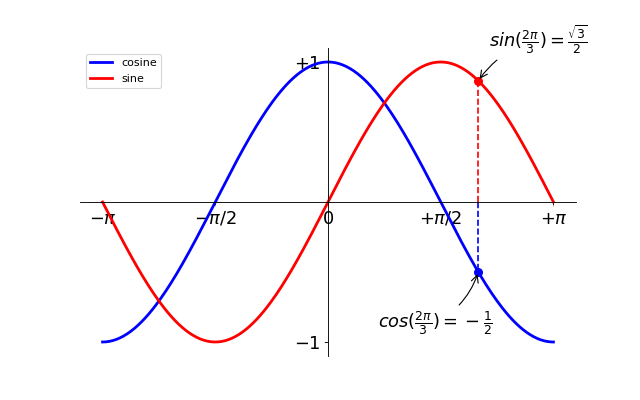

# Managing your progress and getting help with Git and Github

GitHub is a code hosting platform for version control and collaboration. It lets you and others work together on projects from anywhere. Implement the [GitHub Hello World project](https://guides.github.com/activities/hello-world/). Learn how you can [contribute back by opening and closing issues](https://guides.github.com/features/issues/), how you can [socialize](https://guides.github.com/activities/socialize/) and how you can [write in GitHub markdown](https://guides.github.com/features/mastering-markdown/). 

> Assignment: study the `bootcamp` repository. Is there something you would like to improve? Open an issue and, if you are up for it, propose to resolve the issue by opening a PR.

# Scientific communication with LaTeX and Overleaf

LaTeX allows you to easily typeset documents that contain a lot of mathematics. In order to use LaTeX, you first need to study the [structure and syntax of LaTeX documents](https://www.overleaf.com/learn/latex/Free_online_introduction_to_LaTeX_(part_1)). You can write and typeset LaTeX documents in your browser using [Overleaf](https://www.overleaf.com). LaTeX can also be used as an alternative to using PowerPoint for [creating a presentation](https://www.overleaf.com/learn/latex/Free_online_introduction_to_LaTeX_(part_3)) (make some of the excercises in this document to familiarize yourself).

> Assignment: typeset the [time-dependent Schrödinger equation](https://en.wikipedia.org/wiki/Schr%C3%B6dinger_equation#Time-dependent_equation) and add [an image of Erwin Schrödinger](https://en.wikipedia.org/wiki/Schr%C3%B6dinger_equation#/media/File:Erwin_Schrodinger2.jpg) in a document on Overleaf. Add the typeset document to an issue and assign your supervisor to review.

# Data Science with Python and Google Colab

Google Colab allows you to write and execute Python in your browser. The following [iPython notebook](https://colab.research.google.com/notebooks/intro.ipynb) will show you how this is done.

The best way to learn scientific Python is to look at the courses offered on [DataCamp](https://www.datacamp.com) for interactive tutorials. You can get three months of free access if you get the [Github Education Pack](https://education.github.com/pack). The [SciPy Lectures](http://www.scipy-lectures.org) provide an overview of what you will learn.

> Assignment: program an iPython notebook in which you
> - diagonalize a random 40 by 40 matrix and a random symmetric 40 by 40 matrix. 
> - reproduce the following image using [matplotlib](https://matplotlib.org/)
> 

> 
> 

> Add the iPython notebook to an issue and assign your supervisor to review.

# Introduction to capstone project

Now that you are able to collaborate through Git/Github, write your report in LaTeX/Overleaf and perform computational research with Python/Colab you can already take a look at the [capstone project](../project/README.md). If you want to run the notebooks in that project, open them in Google Colab.
