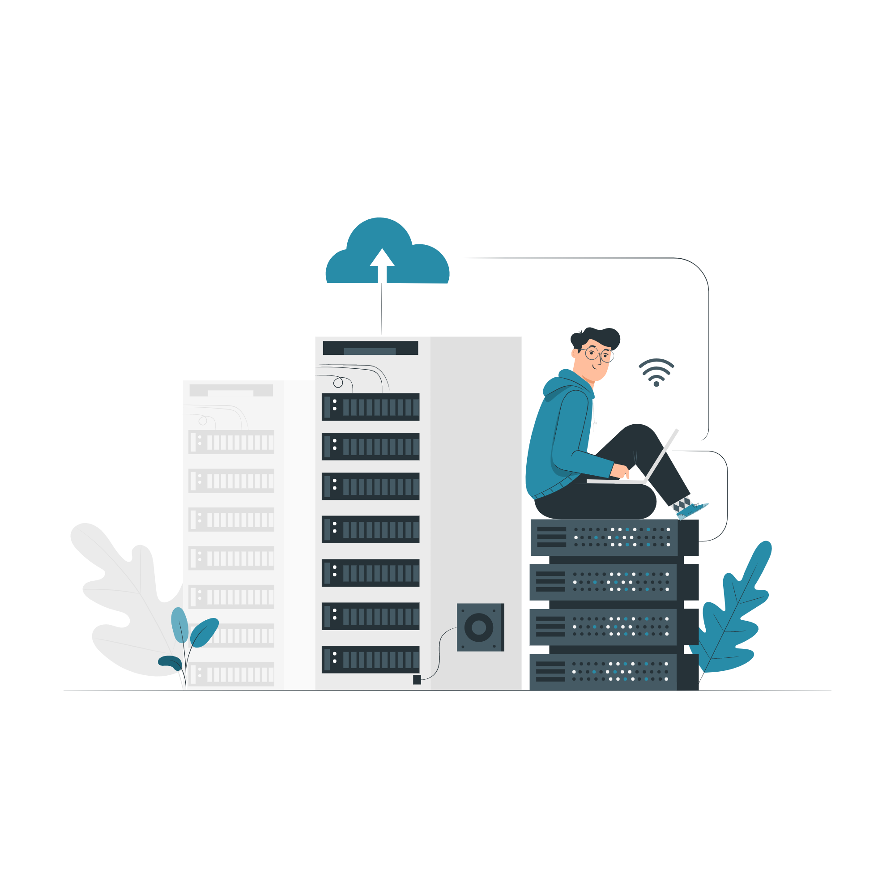
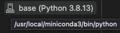

# Enhanced collaboration with version control and Git

[Git](https://git-scm.com/downloads) is a state-of-the-art version control system and using Git with [Github](https://www.github.com) allows for efficient workflows. To see what Git is all about, check out the [Git lectures](https://swcarpentry.github.io/git-novice). 

> Assignment: Fork the `bootcamp` repo and pull your personal fork repo to your local machine. Commit a file `hello.md` with contents 'Hello, <G|QC|G>!' to the master branch of your fork.

# Getting in command with the VSCode editor

The [VSCode editor](https://code.visualstudio.com/) is a highly powerful and customizable cross-platform editor. After you have [gotten started](https://code.visualstudio.com/docs), take a look at the so-called `terminal`. This [terminal](https://swcarpentry.github.io/shell-novice) gives you more power to do more tasks more quickly with your computer. VSCode also has [builtin Git support](https://code.visualstudio.com/docs/introvideos/versioncontrol).

> Assignment: Open the local copy of your fork with VSCode. **Inside VSCode**, commit a new field `vscode.md` with contents 'Hello, VSCode!' to the master branch of your fork. Note that VSCode has a built-in Preview for markdown documents
> 
> 

> 
> 

# Installing software with Docker containers

[Docker](https://www.docker.com/) allows us to easily share software and development environments that contain everything you need to finish this bootcamp. After you have [installed Docker](https://www.docker.com/get-started), [play around with Docker](https://www.docker.com/play-with-docker). Note that Windows users first need to install the [Windows Subsystem for Linux](https://docs.microsoft.com/en-us/windows/wsl/install).

VSCode has [excellent support for Docker](https://code.visualstudio.com/docs/remote/containers-tutorial). After installing the `Remote - Containers` extension in VSCode, open the folder containing your local copy of the bootcamp repo in VSCode. You should get the option to open the folder in a custom Docker container.

This will initiate a **one-time** download (approximately 5GB) and can take some time depending on your internet connection. If you have configured VSCode correctly in the steps above, you can run iPython notebooks directly in VSCode. Check this by opening the [introduction to PSI4 notebook](../projects/intro-to-psi4.ipynb) in the `projects` folder in VSCode and running the code cells. 

> Hint: Make sure you are using the kernel `/usr/local/miniconda3/bin/python`.
>
> 

> 
> 

In a similar way, you can now typeset *.tex documents locally. Open the [LaTeX test file](latex/main.tex) and typeset the document using Cmd/Ctrl+Shift+P > `LaTeX Workshop: Build LaTeX project`. You can open the resulting *.pdf in a separate tab (Cmd/Ctrl+Shift+P > `LaTeX Workshop: View LaTeX PDF file.`). Note that you can navigate your LaTeX code from insight your *.pdf by Ctrl/Cmd+clicking on a piece of text in the *.pdf.

# Collaborating Live: VSCode LiveShare

[Live Share](https://code.visualstudio.com/learn/collaboration/live-share) enables you to quickly collaborate with a friend, classmate, or professor on the same code without the need to sync code or to configure the same development tools, settings, or environment.
